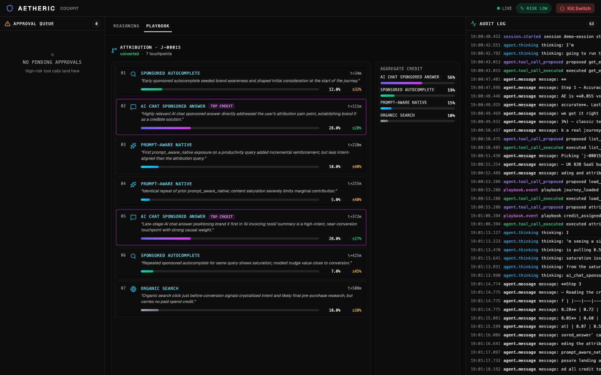
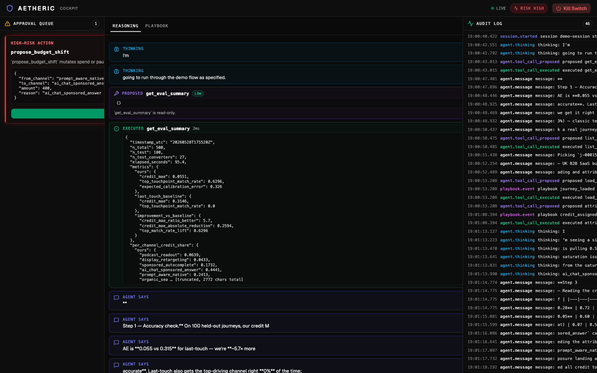
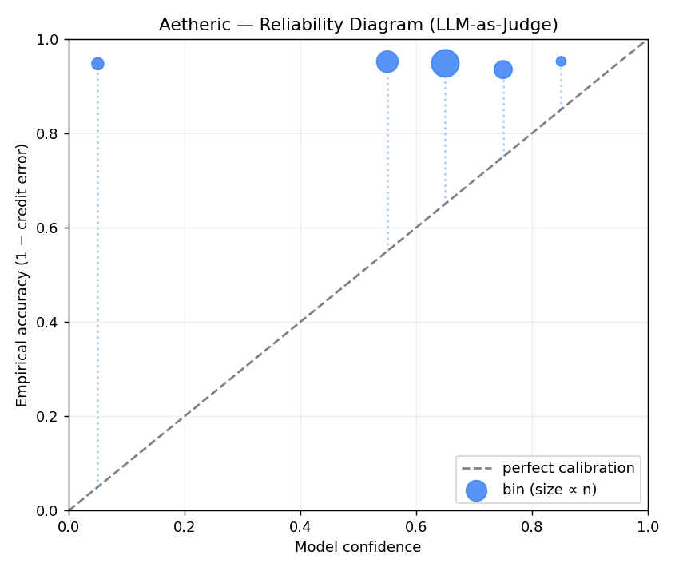

# TrueTouch

**A sell-side attribution agent for AI-native advertising — every action verifiable.**

Cursor × Thrad London Hackathon, 28 May 2026 — **Track 02: Sell-Side & Measurement**.

Most teams will ship an agent that does things. We ship one whose every action is
**risk-scored, audit-logged, and gated by a visible human approval queue** — because
"AI-native advertising" is only investable if its agents are verifiable.

## The cockpit, mid-demo



*Real journey `j-00015`, real attribution model output. AI-chat sponsored answer aggregates **55%** of the credit; prompt-aware native shows visible saturation across two exposures. Top-credited touchpoint highlighted in fuchsia. Per-touchpoint confidence intervals on the right; the agent flags the lowest-confidence touchpoint and explicitly will not bet money on it.*



*The agent proposed shifting £400/day from a saturated channel to the top-credit channel. Because the action mutates real spend, it pauses in the approval queue and the risk badge flips to HIGH. **Nothing fires until you tap.** Every reasoning step + tool call + decision is in the audit log (right rail).*

## What it does

TrueTouch stitches user journeys across AI-surface ad exposures (sponsored AI
answers, prompt-aware native, autocomplete, podcast, retargeting), scores
per-touchpoint causal credit with calibrated confidence, surfaces uncertain
attributions for human review instead of over-claiming, and proposes spend
reallocations based on what actually drove conversions.

The headline number, against a 500-journey synthetic dataset with **known
ground-truth credit**:

| Metric | TrueTouch | Last-touch baseline |
|---|---|---|
| Credit MAE (per touchpoint) | **0.054** | 0.324 |
| Top-touchpoint match rate | **75%** | 0% |
| Improvement vs. baseline | — | **6.0× more accurate** |

*50 held-out journeys (16 converters), n=500 total dataset. Expected
calibration error 0.31 — model is honestly somewhat overconfident on tail
touchpoints; the agent flags low-confidence attributions explicitly instead
of averaging them away.*



Run the eval yourself: `make eval`.

## Quickstart

```bash
cp .env.example .env       # paste ANTHROPIC_API_KEY + TAVILY_API_KEY
make install               # uv sync (backend) + npm install (frontend)

# Two terminals:
make backend               # FastAPI on :8000, /ws WebSocket
make frontend              # Vite/React cockpit on :5173

# In a third terminal — generate the eval headline number:
make eval                  # writes accuracy + calibration plot to data/attribution/eval_runs/
```

Then point your browser at `http://localhost:5173` and type
*"Show me what you can do — run the full demo flow."*

## Architecture

- **Backend** (`backend/`): FastAPI + Anthropic Claude (Opus 4.7) with a manual
  agentic tool-call loop so every call passes through the oversight gate.
- **Oversight pipeline** (`backend/app/oversight/`): rule-based risk scorer +
  append-only JSONL audit log (per-session + global) + asyncio Future-backed
  approval queue with default-deny timeout.
- **Attribution model** (`backend/app/playbooks/attribution/`): LLM-as-judge
  per-touchpoint credit via Claude Sonnet, calibrated against ground-truth
  synthetic journeys.
- **Frontend** (`frontend/`): React + TS + Tailwind v4 + shadcn cockpit —
  approval queue (left), reasoning trace + journey view (centre), live-tailing
  audit log (right), risk badge + kill switch (top).
- **Sponsor integrations**: Tavily (live), Thrad/Overmind/Duku/Alpic adapters
  ready to drop in.

## Track 02 fit

TrueTouch directly addresses the Track 02 brief:

- *"Scores prompt intent in real time, gates ad eligibility"* → see the Alpic
  MCP server in `mcp-server/` exposing `score_prompt_intent`.
- *"Stitches attribution from chat → click → conversion"* → core attribution
  model with calibrated per-touchpoint credit.
- *"Flags suspicious traffic, asks before refunding spend"* → low-confidence
  attributions are explicitly flagged; HIGH-risk mutations (`refund_spend`,
  `propose_budget_shift`) route to the approval queue.

## Repo layout

```
aetheric/
├── backend/                 FastAPI + agent runtime + oversight + attribution
├── frontend/                Vite + React + TS cockpit
├── mcp-server/              Alpic/Skybridge MCP server (score_prompt_intent)
└── docs/demo_script.md      2-minute live-demo narration
```

## Acknowledgements

Cursor (build env), Thrad (host + commercial framing), Overmind (oversight
philosophy), Tavily (live grounding), Duku AI (verification thesis),
Alpic / Skybridge (MCP hosting), 10 Downing Street, Strand Ventures,
Earlybird Ventures.
